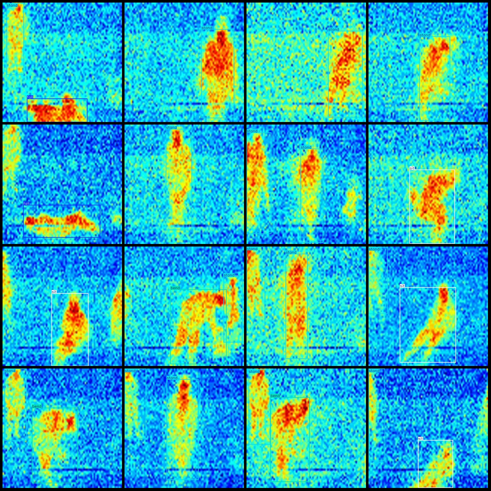

# Infrared Image Human Body Posture Slump Fall Detection Dataset VOC+YOLO Format with 700 Images in 4 Categories

Dataset format: Pascal VOC format + YOLO format (txt file without segmentation paths, only containing jpg images and corresponding VOC format xml files and YOLO format txt files).
Number of images (jpg file count): 700
Number of annotations (xml file count): 700
Number of annotations (txt file count): 700
Number of annotation categories: 4
Repository: firc-dataset
Annotation category names (notice that the order of categories in the YOLO format does not correspond to this, but is based on the labels folder classes.txt): ["bend", "fall", "sit", "stand"]
Number of bounding boxes for each category:
bend (Bend) bounding box count = 75
fall (Fall) bounding box count = 122
sit (Sit) bounding box count = 215
stand (Stand) bounding box count = 607
Total bounding box count: 1019
Image resolution: 640x640
Annotation tool used: labelImg
Annotation rules: Draw a rectangle around the category
Important note: No special declarations are made here
Special statement: This dataset does not guarantee the accuracy of the trained models or weight files
Image preview:
Annotation example:

## Images

Here is a pay link on Stripe ( https://buy.stripe.com/3cs8yP7sY87d0vu9AB ). Please contact me lonlonago@foxmail.com after funding $89, and I will send you a complete data files , thank you!

